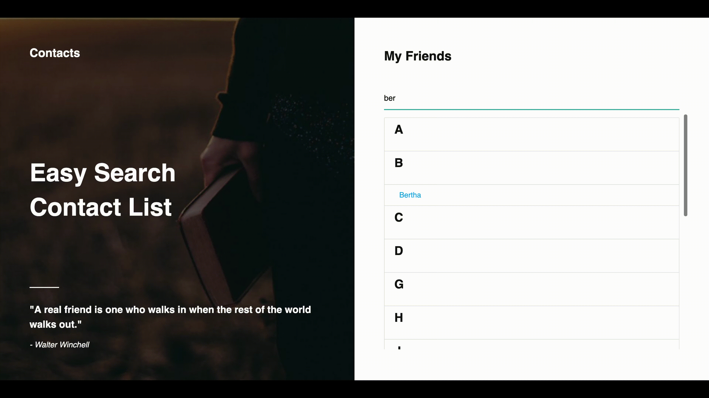

# My Contacts

- This repo is the code for the contact list api web app project I created.

- This app loads names from the [UI Names API](https://uinames.com/){:target="_blank"} in an object.

- This app uses `localStorage()` to store the api data as a string in web storage.

- It will then check the web storage every time you reload the page or close and reopen the app and load the data from the store and parse it as an object.

- The code filters the object list of names and `sorts()` them in alphabetical order.

- It then groups the names and adds the first letter before each group.

- You can search through the contacts by name and it will filter the contact list below.

- This app is fully responsive.

- The design features a hero image, a heading and a quote.

### Screenshot

### Demo 
[Click here to see the demo](https://ecstatic-nightingale-cc21a8.netlify.com/)

